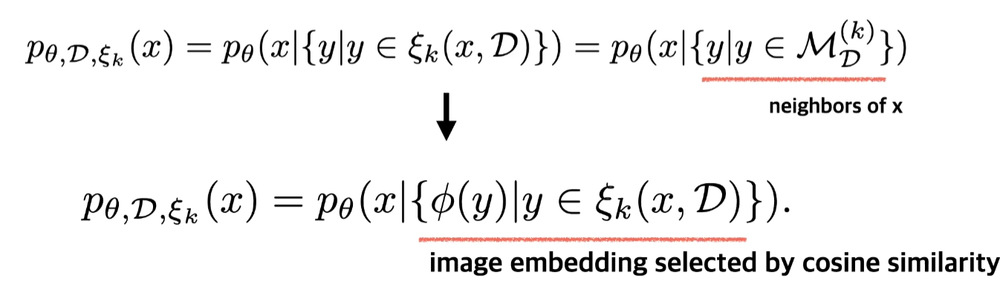
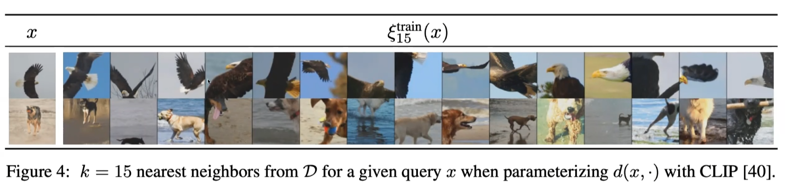
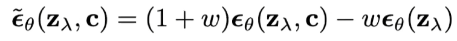
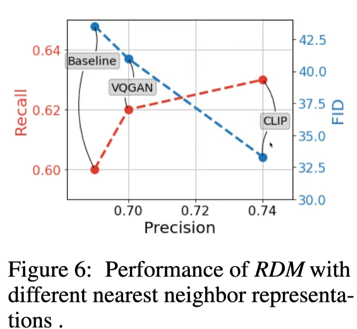
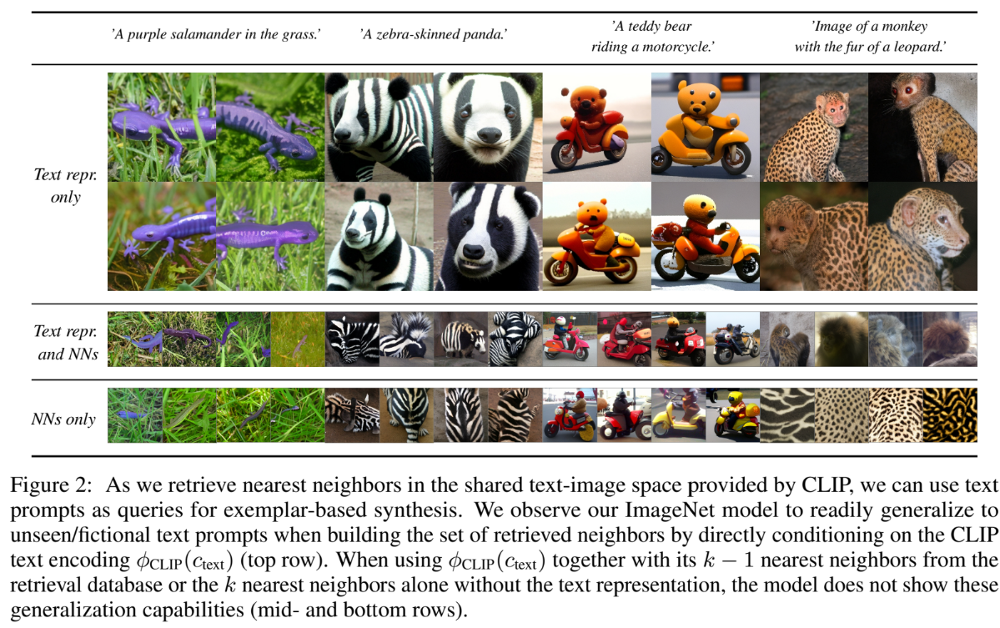

잘못된 내용에 대한 피드백은 언제나 감사합니다. 간단하게 요약하고자 하는 것을 추구하는데, 몰랐던 내용들이 많아서 논문의 대부분 내용을 포함시켰습니다.

# Abstract

논문은 NLP에서 성공적이었던 retrieval-based approach를 사용하여 diffusion model을 보완했다. 학습 시에, CLPI과 training instance에 이웃한 요소들과 같은 visual features를 retrieve하여 학습한다. 

논문의 모델은 CLIP의 image-text embedding space를 사용하는데, class-conditional이나 text-image synthesis처럼 explicity train을 하지 않는 task에 대해서 높은 성능을 보여준다. 또한 text와 image embedding에 모두 영향을 받을 수도 있다. 

논문의 모델은 SOTA를 찍은 unconditinal generation에도 적용할 수 있다. 

논문의 접근법은 적은 컴퓨터 자원을 소모하고 구현하기 쉽다고 한다. 

# Introduction
Language modeling과 high-fidelity images / other data types에 대한 generative synthesis는 엄청난 도약을 이뤘다. 특히 image synthesis에서 큰 충격을 준 결과들이 나왔다. [Ref 1, 2, 3, 4] 
이에 대한 3가지 main factor들은 아래와 같다.  

1. Vision task에서 transformer의 성공. Image synthesis에서는 이를 autoregressive modeing으로 수행했다.
2. Diffusion model이 high-resolution image generation에 성공적으로 적용됐고, generative image modeling의 표준이 됐다.
3. 1, 2번의 방법들은 scale이 잘 된다. 특히, 모델과 배치 사이즈를 고려할 때 scalability가 성능에 핵심적이라는 증거가 있다. 

하지만 대부분의 성능 개선 방법은 단순히 computational power와 parameter를 늘림으로써 이뤄진다. 이 논문은 이러한 방법을 사용하지 않고 성능을 향상시키고자 한다. 

반대로, retrieval-augmented generative language model의 성공에 영감을 얻어서, 논문은 visual examples의 memory를 위해 trainable parameters를 trade-off?한다. 또한 image database에 의하여 제안된 모델의 일부를 명시적으로 정의한다. (무슨 말인지 모르겠다..)

Training하는 동안, retrieval-augmented semi-parametric model은 nearest neighbor lookup을 통해 데이터베이스에 접근하고 retrieved visual building blocks를 기반으로 synthesize images를 학습한다.

이러한 retrieval-enhanced 전략을 diffusion model과 결합하는 것으로 multi-modal datasets에서 fully parametric conterparts를 능가하는 경량화 모델을 얻을 수 있다.

  

Fig2에서는 CLIP을 사용하여 text-image space에서 nearst neighbors를 retrieve할 때, text prompts를 exemplar-based synthesis의 쿼리로 사용함을 보여준다. CLIP의 text encoding인 $\phi_{\tiny CLIP}(c_{\tiny text})$에 직접적으로 영향을 받아 retrieved neighbors를 구성할 때, 논문의 ImageNet 모델이 unseen/fictional한 text prompt를 일반화할 수 있음을 관찰했다. 
반면 $\phi_{\tiny CLIP}(c_{\tiny text})$를 retrieval database에서 가져온 $\phi_{\tiny CLIP}(c_{\tiny text})$와 관련 있는 k - 1개의 nearest neighbors와 함께 사용하거나, 혹은 text representation 없이 k개의 nearst neighbors와 사용한다면 모델은 generalization capabilities를 보여주지 않았다.

즉, Fig2는 'NNs only'와 'Text repr. and NNs'는 'Text repr. only'에 비해서 generalization capailities가 떨어지는 것을 보여주는 것이다.

## Abstract summary
따라서 논문은 retrieval-augmnented generative modeling with diffuson model이라는 간단한 framework를 보여준다. CLIP의 latent space에서 seraching, conditioning을 진행함으로써 아주 작은 컴퓨팅 연산만으로 nearest neighbo representation을 만들 수 있는 것이다. 또한 retrieval 속도는 매우 빠르고 CLIP embedding은 매우 작은 storage만을 요구한다. semi-parametric approach는 high fidelity와 diversity를 모두 충족시킬 수 있다고도 한다. 

CLIP의 image-text features를 사용하는 것으로 Fig2에서 보여줬던 text-to-image, class-conditional synthesis와 같은 다양한 conditional application을 만들 수 있다. 

마지막으로 test time에서 retrieval database를 변화시키는 것이 synthesis process control에 추가적인 flexibility를 부여하는지 demonstrate 할 것이다. 또한 이것이 기존의 classifier-free diffusion model과 어떻게 결합되는지도 보여줄 것이다.

# Related work

## Diffusion Models for Image Synthesis
일반적인 diffusion model의 성과와 한계에 대해서 짚는다. ImageNet과 같은 복잡한 Dataset에 대해서 unconditional image generation을 할 때, 모델의 크기와 compute resources가 많이 요구된다고 한다.

논문은 이러한 한계를 극복하기 위해 trainable parameters를 external memroy와 교환하는 것을 제안한다. 이를 통해 작은 모델이라 할지라도 지속적으로 발전하는 모델과 동등한 수준의 high fidelity image generation을 수행할 수 있도록 한다.

## Retrieval-Agumented Generative Models
External memory를 활용하여 기존 모델의 성능을 향상시키는 것은 NLP 분야에서 많이 사용하는 기법이다. RETRO[5]의 경우 더 적은 parameter와 compute resources를 사용해서 SOTA를 찍은 retrieaval-enhanced transformer를 제안했다. External memory를 사용한 retireval-augmented model이 parametric deep learning model을 semi-parametric model로 변환했다.

초기의 retireval-augmented visual model들은 external memory를 사용하지 않고 retrieval를 위해 training data를 사용했다. IC-GAN의 경우, GAN을 학습시키기 위해 training images의 neighborhood를 활용하고 training data의 single instances에 제한을 받아 samples를 생성한다. 

하지만 training data를 retireval 대상으로 삼았기 때문에 generalization capacity가 떨어질 수 밖에 없고, 우리는 exteranl memory를 통해 이를 해소하고자 한다.

## Concurrent Work
최근에 본 논문과 비슷한 연구들로 unCLIP[6]과 kNN-Diffusion[7]이 제안됐다. 

unCLIP은 CLIP의 representation으로 diffusion model을 conditioning하고 large-scale computation을 사용해서 high quality text-image results를 만든다. 하지만 본 논문의 연구와 다르게, 이 모델은 training data에 대한 CLIP representation에 제한을 받기 때문에, geneartive text-image를 나중에 학습한다. 

kNN-Diffusion은 unCLIP의 위와 같은 문제를 neighborhood를 통해 conditioning함으로써 회피하는데, 이것은 본 논문의 연구와 매우 유사하다. 또한 서로 다른 형태의 neighborhood representation을 분석하기 위해 discrete diffusion formulation보다 continuous formulation을 사용했고 text-image synthesis에 제한되지 않는다는 점 또한 매우 유사하다.

# Image Synthesis with Retrieval-Augmented Diffusion Models

## Retrieval-Enhanced Generative Models of Images
Semi-parametric generative model by introducing a tuple of trainable and non-trainable model components.

A non-trainable samping strategy obtains a subset of the database based on a query.

  

  

  

<!-- Semi-parametric generative model에서는 $p_{\nu}(x)$를 학습한다. 
이 때, $\nu = \{\theta, \mathcal{D}, \sampling}$,  where $\mathcal{D} = \{y_i\}_{i=1}^{N}$ is a fixed database of images $y_i \in \mathbb{R}^{H_{\mathcal{D}} \times W_{\mathcal{D}} \times 3}$

일반적인 모델은 $\nu$ 자리에 $\theta$가 오지만, semi-parametric model은 3가지 factor를 기반으로 학습한다.

$
p_{\theta, \mathcal{D}, \sampling}(x) 
= p_{\theta}(x \vert \{y \vert y \in \sampling(x, \mathcal{D})\})
= p_{\theta}(x \vert \{y \vert y \in \mathcal{M}_{\mathcal{D}}^{(k)}\})
\label{eq:modelbase}
$ -->
## Semi-Parametric Diffusion Models
논문의 연구진들이 이전에 연구했던 LDM(Latent diffusion model)을 활용했다. VQ-GAN의 latent space에 대해서 Diffusion model을 태운다고 생각하면 된다고 한다. 예를 들어서, VQ-GAN에서 256x256 이미지를 64x64로 donwsampling하고 여기서 reverse diffusion process를 학습한다.

unCLIP의 경우, 64x64의 이미지를 직접 학습하기 때문에 이릘 256x256으로 변환시켜주는 super resolution을 따로 학습해야 한다. 반면, LDM은 VQ-GAN의 latent space를 사용했기 때문에 VQ-GAN에 다시 64x64 이미지를 넣어줘서 256x256 이미지를 얻는다.
  
  

Object function은 DDPM에서 제공된 formula를 사용한다. 

## Inference for Retrieval-Augmented Diffusion Models

Training 과정과 다르게 Inference에서는 Query image가 존재하기 않기 때문에 별도의 process를 추가해야 한다. 
  

text query를 만들어서 CLIP으로 text-conditional generation을 해볼 수 있을 것이다. query image가 없다고 할지라도, CLIP은 text-image의 shared representaion을 가지고 있기 때문에 이처럼 활용할 수 있다.

1. Image 대신 text query를 간단하게 만든다. 
2. CLIP embedding을 통해 text query의 text embedding을 구한다.
3. text embedidng과 datset image들간의 유사도를 통해서 neighborhood를 얻는다.

Inference 가능한 내용을 정리하면 아래와 같다.
- text-to-image
  - text query의 embedding을 CLIP을 통해 구한다. 이를 활용해 neighborhood searching에 사용
- class-condition
  - text query로 "A photo of { }"를 사용
- unconditional
  - Fixed dataset에서 random하게 sampling하고 이에 대한 neighborhood searching을 할 수 있다. 하지만 이렇게 시도한 결과 단순한 이미지이거나 reference와 유사한 이미지만 나왔다고 한다.
  따라서 아래와 같이 proposal distribution을 만들어서 실제로 학습에 많이 기여한 sample 위주로 고를 수 있도록 했다고 한다.
    
  proposal distribution을 통해 pseudo query를 생성하고 이를 통해 neighborhood seraching해서 unconditional generation 수행.

## Trading Quality for Diversity
### Truncation distribution of datasets
  
Unconditoinal generation 수행 시 너무 다양하게 이미지가 생성되기 때문에, density가 높은 top m개만 사용했다고 한다.

### Classifier-free guidance
  
conditional image generation에서 generation 품질 향상을 위해 사용했다. condition, uncondition 상황에서 모두 generation 해보고 두 상황의 차이만큼 denoising을 하도록 하는 것이다. 

# Methods Overview
  

# Experiments
## Experiments settings
- Decoding head(generative model): LDM with 400M parametes. 기존 LDM이 500M이기 때문에 약간 작은 모델이다.
- Retrieval model: CLIP-ViT-B/32 
- Fixed Database: 20M examples of OpenImages(9M). OpenImages의 resolution의 한 차원이 보통 1200보다 크기 때문에, 하나의 이미지에서 2 ~ 3개의 patch를 뽑아서 사용.
- Training dataset: ImageNet
- NN search: ScaNN search algorithm

## Image encoder
  
VQ-GAN도 pooling을 통해서 구현할 수 있지만, 역시 CLIP embedding을 사용하는 것이 제일 좋았다고 한다.

## K-NN
  
K에 따른 evaluation이다. K가 증가할수록 recall, precision, FID, IS가 떨어진다. classifier-free guidance 등을 통해서 image의 품질을 높일 수는 있기 때문에 recall이 높아지는 방향으로 K를 설정하지 않았나 생각한다고 하신다.[8]

## Patch size
  
OpenImages의 resolution이 매우 높기 때문에 patch를 어떻게 하느냐도 중요했다고 한다. 이를 patchify이라고 하는데, size가 클 수록 성능이 좋았다고 한다.

엄격한 evaluation은 아니라고 할 수 있는데, CLIP이 64x64로 학습되어 있지 않기 때문에 64x64에 대한 성능이 나쁘게 나왔다고도 볼 수 있기 때문이다.[8]

## Training data complexity
  

Generation하고자 하는 target을 변경하면서 실험한 것이다. Dogs, Mamals, Animals로 범위를 늘릴수록 precision, FID는 baseline, SP-LDM 모두 지표가 나빠진다. 하지만 recall의 경우 SP-LDM은 지표가 오히려 좋아진다.

generation 성능이 하락하더라도 external dataset에서 관련된 이미지를 가져오고 이것과 유사한 이미지를 generation하고자 노력할 것이다. 따라서 recall 수치가 올라간다고 논문에서는 주장한다. 

## Unconditiona generation result
  

## Conditional generation result
  

class에 대한 CLIP의 text embedding과 k - 1개의 nearest neighborhood를 통해 generation해도 잘 만든다고 한다. 학습할 때 class-condition을 사용하지 않았기 때문에 의미가 있다고 한다.

## Text-to-image
  
사용 가능한 경우의 수는 아래와 같다.
- text embedding condition
- text embedding + nearest neighborhood condition
- nearest neighborhood condition

ImageNet으로만 학습했음에도 CLIP의 text embedding으로 condition해도 결과가 잘 나왔다고 한다. 오히려 image에 대한 많은 정보를 줄 수록 성능이 하락함을 볼 수 있다. text embedding과 nearest neighborhood를 함께 사용하면 text embedding만  사용했을 때보다 좋지가 않은데, 

# Reference
- Paper: https://arxiv.org/abs/2204.11824
- 1: [Taming Transformers for High-Resolution Image Synthesis](https://arxiv.org/abs/2012.09841)
- 2: [Diffusion model beat GANs on image synthesis](https://arxiv.org/abs/2105.05233)
- 3: [Glide: Towards photorealistic image generation and editing with text-guided diffusion models](https://arxiv.org/abs/2112.10741)
- 4: [Hierarchical text-conditional image generation with clip latents](https://arxiv.org/abs/2204.06125)
- 5: [Improving language models by retrieving from trillions of tokens](https://arxiv.org/abs/2112.04426)
- 6: [Hierarchical Text-Conditional Image Generation with CLIP Latents](https://arxiv.org/abs/2204.06125)
- 7: [Knn-diffusion: Image generation via large-scale retrieval](https://arxiv.org/abs/2204.02849)
- 8: https://www.youtube.com/watch?v=Ktgt7bcXLYI